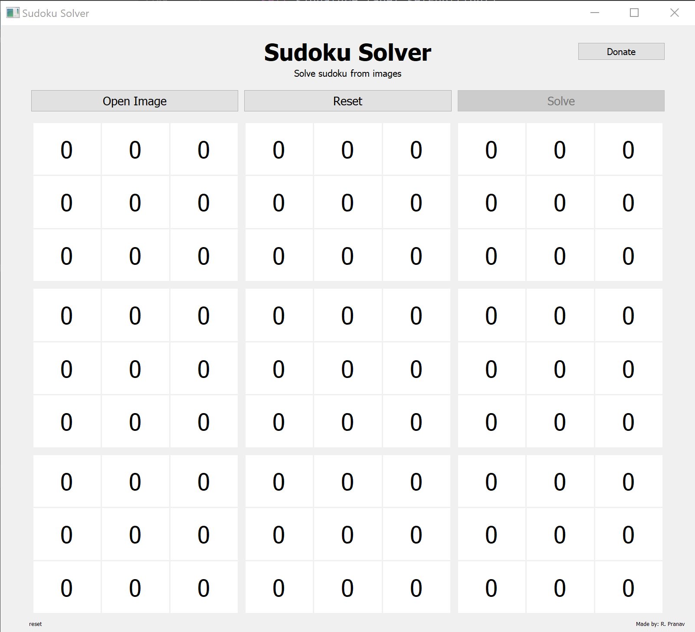

# Sudoku_Solver
An Image Based Sudoku Solver, made using OpenCV and Tensorflow in Python. GUI is also available.

This is a hobby project, and the code is not yet optimised, but I am happy to take any input from the community for any improvements. I will try to explain my code in this Readme file, Please feel free to scavenge any part of my code if you find it useful. 

Libraries used
```
pip install opencv-contrib-python
pip install tensorflow
pip install PyQt5
pip install pyqt5-tools
pip install psutil
```
The core of this Project contains 5 python scripts which are

- solver.py - This is the actual script that solves the sudoku.
- image_prep.py - This script takes and image which contains sudoku and converts it into a matrix.
- image_prep_function.py - This is basically does the same function as the above script but is an older version and uses functions. This file is not particularly useful but I just kept it. This file can be deleted though GUI does not use this script.
- sudoku_gui.py - Most of this script is autogenerated by the QT-Designer but I added few methods in this script. 
- digit_training.py - This script does the neural network training and saves the model as a .h5 file which will be used later.

All scripts could be run individually to get the corresponding output.

solver.py <br>
This script solves the sudoku matrix <br>
For ever blank in sudoku it find the union numbers presents in the same row, column and the 3*3 square and subtracts it from the the full set which contains all the numbers from 1-9. 
These are the potential numbers for that blank and when the length of the potential numbers for a blank is 1 we set that number in that blank.

image_prep.py or image_prep_funtion.py <br>
This scripts does various image processing steps to find the sudoku matrix in the image and segmenting it. It finds the Hough lines, filters it and finds all the small cells in the sudoku. Then these small cells the passed through a neural network to find the predictions.

sudoku_gui.py <br>
Well this is the GUI mostly autogenerated.

digit_training.py <br>
This script trains the neural network. I used validation dataset of Mnist Digit Dataset along with some of my own images. You can make your own dataset by slightly modifying the image_prep_function.py script
<br>
<br>
<br>
If you face scalling issues in the GUI
```
# Change the default value if you face scaling issues
    
    ap.add_argument("-s", "--scale_factor", default= 2, help="Enter the Scale_Factor")
    args = vars(ap.parse_args())
```
Change the default value in the sudoku_gui.py script or run the program as
```
python sudoku_gui.py -s [your scale factor]
```

<br>
